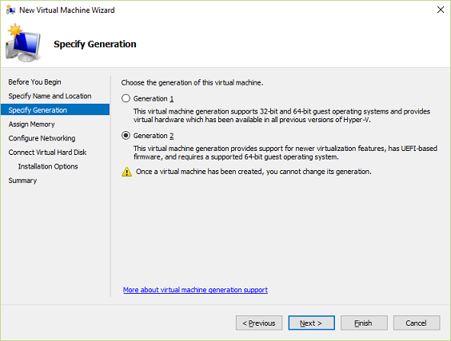
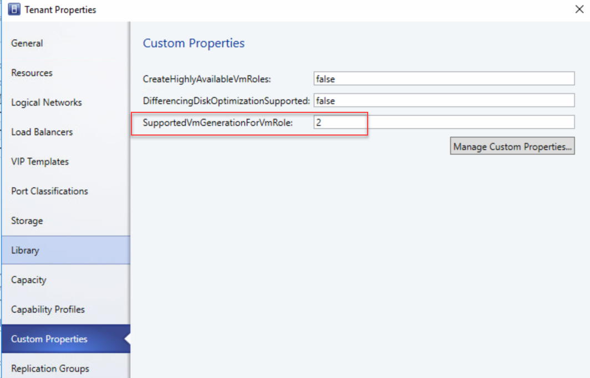
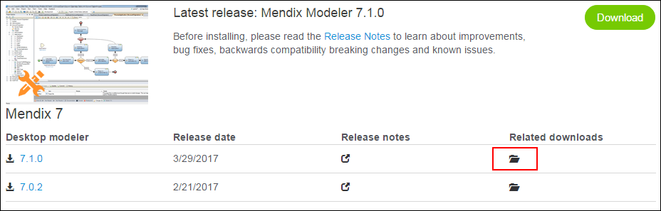

# Create a Multi Instance base image

The VM Role artifacts depend on a base image to be available. The artifacts are tested using a Windows Server 2016 base image and might or might not work with Windows Server 2012 R2.

## Create a VM

On a Hyper-V machine, create a VM.

Make sure you choose the VM generation for which the VM Role will be created (you can't deploy Generation 1 (BIOS) vhdx images to a Generation 2 (UEFI) enabled cloud and vice versa).

.

The VM Generation which will be deployed in Azure Pack is defined on the SCVMM Cloud Level and can be different per cloud (consult with the Azure Pack supplier on what generation to prepare).



## Install and patch Windows Server

Attach a Windows Server 2016 ISO file and proceed with a normal setup of either Windows Server 2016 Standard or Datacenter with Desktop Experience (don't botter with customizations like language, keyboard and such as the Windows installation will be generalized once done).

\* A Product key doesn't have to be supplied.

It is advisable to patch the Windows Installation once setup is done.

## Prerequisites

The installation needs to have a couple of prerequisites set / installed before it can be generalized.

* Install .Net 3.5 (have the ISO still mounted)
  ```powershell
  Install-WindowsFeature -Name NET-Framework-Core -Source D:\sources\sxs\
  ```
* Install IIS and other required features
  ```powershell
  Install-WindowsFeature -Name Web-Server, Web-Asp-Net45, Web-Mgmt-Tools
  ```
* Download and install URL rewrite module
  ```powershell
  $url = 'http://download.microsoft.com/download/D/D/E/DDE57C26-C62C-4C59-A1BB-31D58B36ADA2/rewrite_amd64_en-US.msi'
  Invoke-WebRequest -UseBasicParsing -Uri $url -OutFile $env:Temp\rewrite.msi
  Start-Process -FilePath $env:Temp\rewrite.msi -ArgumentList '/quiet' -Wait
  Remove-Item -Path $env:Temp\rewrite.msi -Force
  ```
* Download and install External Cache
  ```powershell
  $url = 'http://download.microsoft.com/download/C/A/5/CA5FAD87-1E93-454A-BB74-98310A9C523C/ExternalDiskCache_amd64.msi'
  Invoke-WebRequest -UseBasicParsing -Uri $url -OutFile $env:Temp\externalcache.msi
  Start-Process -FilePath $env:Temp\externalcache.msi -ArgumentList '/quiet' -Wait
  Remove-Item -Path $env:Temp\externalcache.msi -Force
  ```
* Download and install Application Request Routing
  ```powershell
  Invoke-WebRequest -UseBasicParsing -Uri 'http://go.microsoft.com/fwlink/?LinkID=615136' -OutFile $env:Temp\ARR.msi
  Start-Process -FilePath $env:Temp\ARR.msi -ArgumentList '/quiet' -Wait
  Remove-Item -Path $env:Temp\ARR.msi -Force
  ```
* Download and install JRE
  ```powershell
  $url = 'http://javadl.oracle.com/webapps/download/AutoDL?BundleId=220315_d54c1d3a095b4ff2b6607d096fa80163'
  Invoke-WebRequest -UseBasicParsing -Uri $url -OutFile $env:Temp\jre.exe
  Start-Process -FilePath $env:Temp\jre.exe -ArgumentList '/s' -Wait
  Remove-Item -Path $env:Temp\jre.exe -Force
  ```
* Download and install Mendix Service Controller
  * Create Mendix Folder
    ```powershell
    New-Item -Path C:\Mendix -ItemType Directory
    ```
  * Download the latest version of the Mendix Service Console from the [App Store](https://appstore.home.mendix.com/link/modelers):
  
  * Install the Service Controller
    ```powershell
    $pathToInstaller = 'c:\Mendix Service Console 4.5 Setup.msi'
    Start-Process -FilePath $pathToInstaller -ArgumentList '/Quiet' -Wait
    ```
  * Register Files Path
    ```powershell
    Add-Type -Path 'C:\Program Files (x86)\Mendix\Service Console\Mendix.Service.Management.dll'
    $settings = [Mendix.Service.Management.ApplicationManagerSettings]::new()
    $settings.FilesPath = 'C:\Mendix'
    ```
* Create MxAdmin local user
  ```powershell
  $adsi = [adsi]"WinNT://$env:COMPUTERNAME"
  $user = $adsi.Create('User', 'MxAdmin')
  $user.SetPassword('Demo1234!')
  $user.UserFlags = 65600
  $user.SetInfo()
  ([adsi]"WinNT://$env:COMPUTERNAME/Administrators,Group").Add($user.Path)
  ```
* Assign logon as a service rights
  ```powershell
  $sid = [System.Security.Principal.NTAccount]::new('MxAdmin').Translate(
      [System.Security.Principal.SecurityIdentifier]
  ).Value
  $tmpFile = [System.IO.Path]::GetTempFileName()
  secedit.exe /export /cfg $tmpFile
  $policy = Get-Content -Path $tmpFile
  Remove-Item -Path $tmpFile
  $tmpFile = [System.IO.Path]::GetTempFileName()
  $currentLogonAsService = ($policy | Select-String -Pattern "^SeServiceLogonRight.*").ToString()
  @'
  [Unicode]
  Unicode=yes
  [Version]
  signature="$CHICAGO$"
  Revision=1
  [Privilege Rights]
  {0}
  '@ -f ($currentLogonAsService, "*$sid" -join ',') | Out-File -FilePath $tmpFile -Encoding unicode
  secedit.exe /configure /db secedit.sdb /cfg $tmpFile /areas USER_RIGHTS
  ```
* Install Server Runtime
  * Download the runtime: [Download](https://cdn.mendix.com/runtime/mendix-6.8.1.tar.gz)
  * Install the runtime
    ```powershell
    Import-Module -Name 'C:\Program Files (x86)\Mendix\Service Console\Mendix.Service.Commands.dll'
    Install-MxServer -LiteralPath C:\mendix-6.8.1.tar.gz
    ```
* Install Sample App
  * Download the Sample App: [Download](/MendixApp/FieldExampleaHold_1.0.0.8.mda)
  * Install the App
    ```powershell
    Add-Type -Path 'C:\Program Files (x86)\Mendix\Service Console\Mendix.Service.Commands.dll'
    $newApp = [Mendix.Service.Commands.NewAppCommand]::new()
    $newApp.Name = 'MendixApp'
    $newApp.DisplayName = 'MendixApp'
    $newApp.Credential = [pscredential]::new('MxAdmin',(ConvertTo-SecureString -String 'Demo1234!' -AsPlainText -Force))
    $newApp.Invoke()

    Import-Module -Name 'C:\Program Files (x86)\Mendix\Service Console\Mendix.Service.Commands.dll'
    Update-MxApp -LiteralPath C:\FieldExampleaHold_1.0.0.8.mda -Name MendixApp
    ```
* Configure IIS settings
  ```powershell
  Add-WebConfigurationProperty -Filter //staticContent -Name 'collection' -Value @{
      fileExtension = '.mxf'
      mimeType='text/xml'
  }
  Set-WebConfigurationProperty -Filter 'system.webServer/proxy' -Name 'enabled' -Value 'True'
  Set-WebConfigurationProperty -Filter 'system.webServer/proxy' -Name 'preserveHostHeader' -Value 'True'
  Remove-Website -Name 'Default Web Site'
  New-WebAppPool -Name Mendix
  New-Website -Name MendixApp -Port 80 -IPAddress * -PhysicalPath 'C:\Mendix\Apps\MendixApp\Project\web' -ApplicationPool 'Mendix'

  $psPath = 'iis:\sites\MendixApp'

  'xas', 'ws', 'doc', 'file', 'link' | ForEach-Object -Process {
      $filterRoot = "system.webServer/rewrite/rules/rule[@name='$_']"

      switch ($_) {
          'xas' {$pattern = '^(xas/)(.*)'}
          'ws' {$pattern = '^(ws/)(.*)'}
          'doc' {$pattern = '^(ws-doc/)(.*)'}
          'file' {$pattern = '^(file)(.*)'}
          'link' {$pattern = '^(link/)(.*)'}
      }

      Add-WebConfigurationProperty -PSPath $psPath -Filter 'system.webServer/rewrite/rules' -Name '.' -Value @{
          name = $_
          patternSyntax = 'ECMAScript'
          stopProcessing = 'False'
      }
      Set-WebConfigurationProperty -PSPath $psPath -Filter "$filterRoot/match" -Name 'url' -Value $pattern
      Set-WebConfigurationProperty -pspath $psPath -Filter "$filterRoot/action" -Name 'type' -Value 'Rewrite'
      Set-WebConfigurationProperty -PSPath $psPath -Filter "$filterRoot/action" -Name 'url' -Value 'http://localhost:8080/{R:1}{R:2}'
  }
  ```
* Enable RDP
  ```powershell
  $cimInstance = Get-CimInstance -Namespace root\cimv2\TerminalServices -ClassName Win32_TerminalServiceSetting
  $cimInstance | Invoke-CimMethod -MethodName SetAllowTSConnections -Arguments @{
      AllowTSConnections = (1 -as [uint32])
      ModifyFirewallException = (1 -as [uint32])
  }
  ```

## Generalize

Now that the image is done, it has to be generalized.

```cmd
Sysprep.exe /generalize /oobe /shutdown
```

The image is now redeployable.
